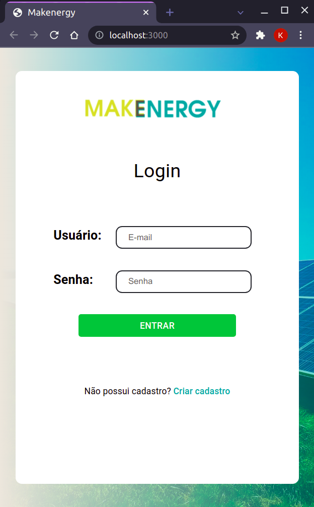

# Makenergy

O projeto consiste na gerência de usinas de energia fotovoltaica, onde um usuário pode cadastrar clientes e suas respectivas participações em uma ou mais usinas específicas, indicando suas porcentagens de participações. Para análise estatística, há também uma página com o gráfico dos dados da usina e informações complementares, como retorno financeiro (considerando R$ 0,95 por kWh), média, desvio padrão e máximo e mínimo registrado.

## Arquitetura

O back-end do projeto consiste em uma aplicação Node que cadastra usuários e fornece tokens de autorização a partir de um login. Os usuários são cadastrados no MongoDB e o hash da senha armazenada é comparada com a senha de uma requisição do front-end, o que faz com que o back-end devolva como resposta um token de acesso válido ou uma mensagem de erro caso as credenciais estejam incorretas.

O front-end fornece interface gráfica com o usuário para cadastro de conta e login, acessando o back-end para obter um token de autenticação e poder prosseguir para as rotas que necessitam de autorização. Foi também dada atenção à responsividade das páginas, variando a disposição dos componentes de acordo com o tamanho da tela do dispositivo. Um usuário é capaz de gerenciar os clientes de uma usina, realizando CRUD com validação dos valores. Além disso, pode acessar os dados estatísticos da usina em um gráfico.

## Instruções de instalação e execução

### Back-end

Primeiramente, certifique-se de que [NodeJS](https://nodejs.org/en/), npm e [Docker](https://docs.docker.com/get-docker/) estão instalados e que as portas 27017 e 3333 estão disponíveis no seu sistema.

1. Entre na pasta *server*
2. Execute `npm install` dentro da pasta *server*
3. Execute o arquivo `create-mongo.sh` e será criado um novo container MongoDB com nome *energy-mongo* e um arquivo `.env` com a configuração de acesso da aplicação com o MongoDB
4. Com o container *energy-mongo* em execução, execute o comando `npm run dev` dentro da pasta *server* para iniciar o back-en

### Front-end

Primeiramente, certifique-se de que o [Yarn](https://classic.yarnpkg.com/lang/en/docs/install/) está instalado e que a porta 3000 está disponível no seu sistema.

1. Com o back-end em execução, entre na pasta *web*
2. Execute o comando `yarn` dentro da pasta *web*
3. Execute o comando `yarn start` dentro da pasta *web*
4. Abra o navegador e acesse http://localhost:3000

## Screenshots
### Desktop
  
  
  

### Mobile
    
